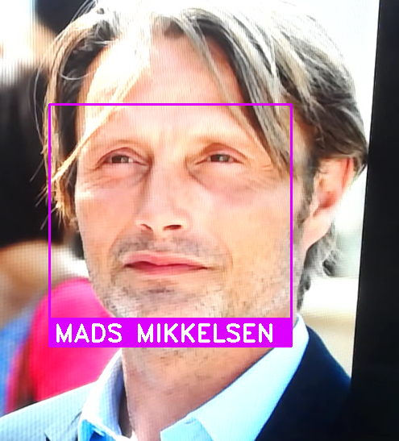

# Facial_Recognition_Attendance
Attendance is taken and marked as a subject is recognized by the program using OpenCV and Python.
Subject is identified, name is shown on screen and then added to the attendance sheet.

